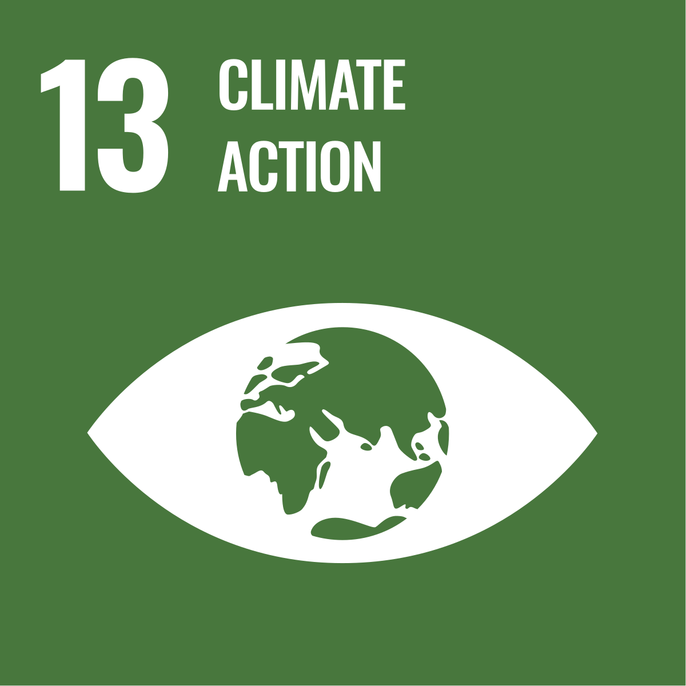
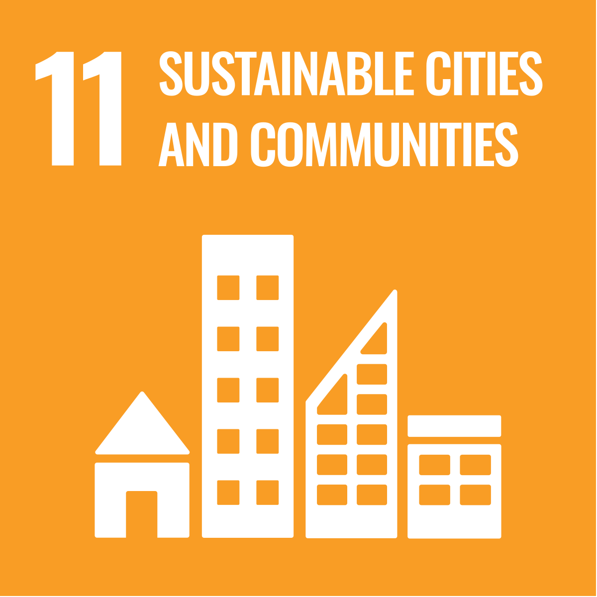

# Redesigning Climate Risk Visualization: A Data-Driven Exploration
## Project Introduction
This project aims to redesign climate risk visualisations for improved accessibility, interpretability, and impact. The work critically engages with existing methodologies by analysing the original heatmap from AWS's climate risk assessment project, addressing its limitations in colour design, data accessibility, and geographic clarity. By applying Amazon QuickSight's visualisation tools, this project creates an enhanced, multi-dimensional view of climate vulnerability and economic losses across countries, supporting better evidence-based climate resilience planning.

## About
Course project for INFOSCI 301 – Data Visualization and Information Aesthetics, instructed by Prof. Luyao Zhang, Spring 2025.

##  Outline
1. Global Climate Risk Map: Interactive filled map by country (CRI scores)

2. Economic Loss Visualization: Bubble maps representing climate-related economic damages

3. Color Optimization: Improved contrast and colorblind-friendly palette

4. Simulated Dataset Integration: Broader variables including deaths and economic losses

5. Sustainability Contributions: Aligning with multiple UN SDGs

6. Field Trip Reflection: Application of emotional storytelling from museum exhibits

## Data Sources and Tools
1. Original Dataset:
The original climate risk heatmap analyzed is from AWS Public Sector Blog（https://aws.amazon.com/cn/blogs/publicsector/leveraging-the-cloud-for-rapid-climate-risk-assessments/).
2. Visualization Tool:
Visualizations were regenerated using Amazon QuickSight, a powerful cloud-based data analysis and dashboarding platform (https://dev.amazoncloud.cn/experience/cloudlab?id=66b57df20d1eb8781b9a77dd).
3. Simulated Dataset for Experimentation:
A simulated dataset was sourced from Kaggle: Global Climate Risk Index and Related Economic Loss, incorporating broader climate-related indicators such as storm frequency, floods, deaths, and economic damages (https://www.kaggle.com/datasets/thedevastator/global-climate-risk-index-and-related-economic-l).

## Replication Guide
To replicate the experimental results:

1. Download the simulated dataset from Kaggle in CSV format.

2. Upload the CSV file to the AWS QuickSight platform.

3. Select the Filled Map visualization feature to recreate the global climate risk visualizations.

## Contribution to Sustainable Development Goals (SDGs)
### Goal 13: Climate Action
Visualizing multi-dimensional climate vulnerability data raises awareness and promotes informed climate resilience planning.

### Goal 11: Sustainable Cities and Communities
By highlighting localized climate risks and losses, the project supports sustainable urban development strategies.

## Acknowledgment
This project benefited greatly from discussions at the Digital Technology for Sustainability Symposium held at Duke Kunshan University. Special thanks to Prof. Luyao Zhang, Prof. Fan Liang, and Mr. Dongping Liu for their valuable insights and Mr. David Schaaf for his guest lecture. Thanks are also extended to my classmates for their collaborative feedback and to the Zhouzhuang Mystery of Life Museum staff for enriching this project with opportunities to explore scientific storytelling and biological specimens.
